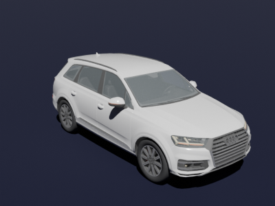
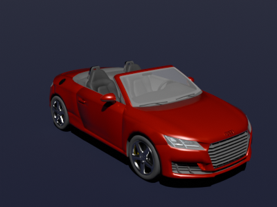
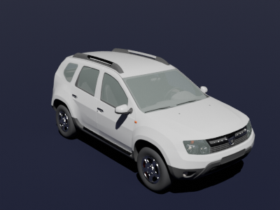
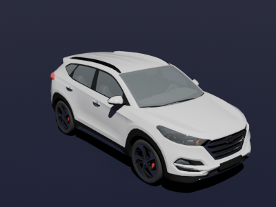
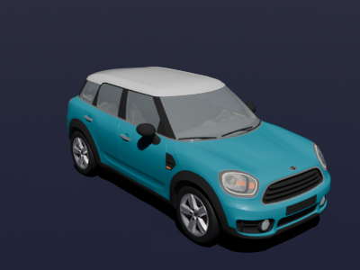
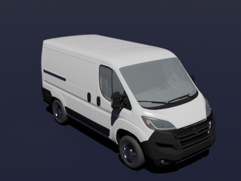

# OpenX Assets

This repository provides a development environment and a curated collection of simulation assets aligned with the ASAM OpenX standards: [OpenDrive](https://www.asam.net/standards/detail/opendrive/), [OpenScenario XML](https://www.asam.net/standards/detail/openscenario-xml/), [OpenMaterial3D](https://www.asam.net/standards/detail/openmaterial/), and [OpenSimulationInterface](https://www.asam.net/standards/detail/osi/).

The simulation assets are originally designed for use with [esmini](https://esmini.github.io/), a lightweight and modular OpenSCENARIO XML simulator, suitable for rapid prototyping, testing, and integration workflows. Future releases will target conformance with the [OpenMATERIAL 3D](https://www.asam.net/standards/detail/openmaterial/) specification, while maintaining compatibility with the OpenSceneGraph (OSG) formats for Esmini support.

## What's Included in Releases

The latest release is available under [Releases](https://github.com/bounverif/openx-assets/releases) and currently includes:
- Low- and medium-polygon 3D vehicle assets with preliminary [OpenMATERIAL 3D](https://www.asam.net/standards/detail/openmaterial/) compliance (work in progress)
- [OpenSCENARIO XML](https://www.asam.net/standards/detail/openscenario-xml/) vehicle catalogs and [OpenMATERIAL 3D](https://www.asam.net/standards/detail/openmaterial/) asset files based on real-world vehicle models, annotated with:
  - ✔️ Bounding box dimensions  
  - ✔️ Mass properties  
  - ⏳ Kinematic parameters (work in progress — contributions welcome)

## 3D Vehicle Gallery

| [](collections/main/m1_audi_q7_2015) | [](collections/main/m1_audi_tt_2014_roadster) | [](collections/main/m1_dacia_duster_2010) |
|:--:|:--:|:--:|
| Audi Q7 | Audi TT Roadster | Dacia Duster |

| [](collections/main/m1_hyundai_tucson_2015) | [](collections/main/m1_mini_countryman_2016) | [](collections/main/n1_fiat_ducato_2014) |
|:--:|:--:|:--:|
| Hyundai Tucson | Mini Countryman | Fiat Ducato |

## Blender Extension Package for Asset Development

This repository includes a basic Blender extension package designed to streamline the creation and validation of simulation assets compliant with ASAM OpenX standards.

To install the extension on a typical Linux environment, create a symbolic link to the Python package within Blender’s default user extensions repository (named `user_default`) as follows:

```bash
ln -s ${PWD}/python/openx_assets ${BLENDER_USER_RESOURCES}/extensions/user_default/
```

Here, `BLENDER_USER_RESOURCES` typically points to the Blender configuration directory, usually located at `$HOME/.config/blender` on Linux. This location may change depending on your Blender distribution source. Please follow Blender guides for installing the extension for other environments.

## GLTF Format

GLTF is the primary interchange format used in this repository for 3D assets due to its efficiency, interoperability, and extensibility. It supports:

- Compact, runtime-optimized binary encoding (`.glb`) for deployment
- Human-readable JSON-based structure (`.gltf`) for inspection and easy tooling
- Native integration with modern rendering engines and web-based visualizers

GLTF is the preferred format for all assets in this repository and serves as the reference format for standards compliance, quality assurance, and downstream integration workflows.

## FBX and OSG Formats

While GLTF is the preferred format, the repository also maintains compatibility with:

- **FBX**: Supported primarily for compatibility with other simulation and asset conversion workflows.
- **OSGB**: Native format for the Esmini simulator. Assets exported in `.osgb` format from the FBX assets can be used directly in Esmini simulation runtime.

Support for these formats ensures backward compatibility and smooth transition paths from existing asset libraries to OpenX-compliant environments.

Due to licensing restrictions, we cannot distribute the Autodesk FBX SDK, which is needed to convert `.fbx`  models into `.osgb`. However, you can install the plugin inside the devcontainer using the script at `/usr/local/bin/fbxsdk-install.sh`.

## License Information

All contents of this repository, including source code, simulation assets, and associated tools, are distributed under the [Mozilla Public License 2.0 (MPL-2.0)](https://opensource.org/licenses/MPL-2.0) unless otherwise specified.

The Openx Assets Blender extension package is distributed under the [GNU General Public License v3.0 (GPL-3.0)](https://opensource.org/licenses/GPL-3.0) or later.
